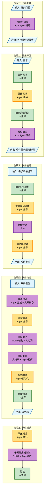

```mermaid
graph TD
    %% 定义样式
    classDef input_output fill:#e1f5fe,stroke:#01579b,stroke-width:2px,color:#000;
    classDef human fill:#c8e6c9,stroke:#2e7d32,stroke-width:2px,color:#000;
    classDef agent fill:#ffe082,stroke:#ff8f00,stroke-width:2px,color:#000;
    classDef human_agent fill:#ce93d8,stroke:#6a1b9a,stroke-width:2px,color:#000;

    %% 阶段一：问题定义
    subgraph 阶段一: 问题定义
        A1[/输入: 真实问题/]:::input_output --> A2[可行性研究 <br/> 人 + Agent辅助]:::human_agent
        A2 --> A3[/产出: 可行性分析报告/]:::input_output
    end

    %% 阶段二：需求开发
    subgraph 阶段二: 需求开发
        A3 --> B1[/输入: 需求/]:::input_output
        B1 --> B2[分析需求 <br/> 人主导]:::human
        B2 --> B3[总结需求 <br/> Agent主导]:::agent
        B3 --> B4[确定系统行为 <br/> 人主导]:::human
        B4 --> B5[检查确认 <br/> 人 + Agent辅助]:::human_agent
        B5 --> B6[/产出: 软件需求规格说明/]:::input_output
    end

    %% 阶段三：软件设计
    subgraph 阶段三: 软件设计
        B6 --> C1[输入: 需求规格说明]:::input_output
        C1 --> C2[确定总体结构 <br/> 人主导]:::human
        C2 --> C3[定义接口设计 <br/> Agent主导]:::agent
        C3 --> C4[组件设计 <br/> 人 + ]:::human_agent
        C4 --> C5[数据库设计 <br/> Agent主导]:::agent
        C5 --> C6[/产出: 系统模型/]:::input_output
    end

    %% 阶段四：软件构造
    subgraph 阶段四: 软件构造
        C6 --> D1[输入: 系统模型]:::input_output
        D1 --> D2[编写代码 <br/> Agent生成 + 人写核心]:::human_agent
        D2 --> D3[单元测试 <br/> Agent主导]:::agent
        D3 --> D4[代码优化 <br/> Agent辅助 + 人定调]:::human_agent
        D4 --> D5[代码审查 <br/> 人终审 + Agent初筛]:::human_agent
        D5 --> D6[系统构建 <br/> Agent自动化]:::agent
        D6 --> D7[集成调试 <br/> 人主导]:::human
        D7 --> D8[/产出: 源代码/]:::input_output
    end

    %% 阶段五：软件测试
    subgraph 阶段五: 软件测试
        D8 --> E1[单元测试 <br/> Agent执行]:::agent
        E1 --> E2[子系统集成测试 <br/> 人设计 + Agent执行]:::human_agent
        E2 --> E3[验收 <br/> 人主导]:::human
    end
```